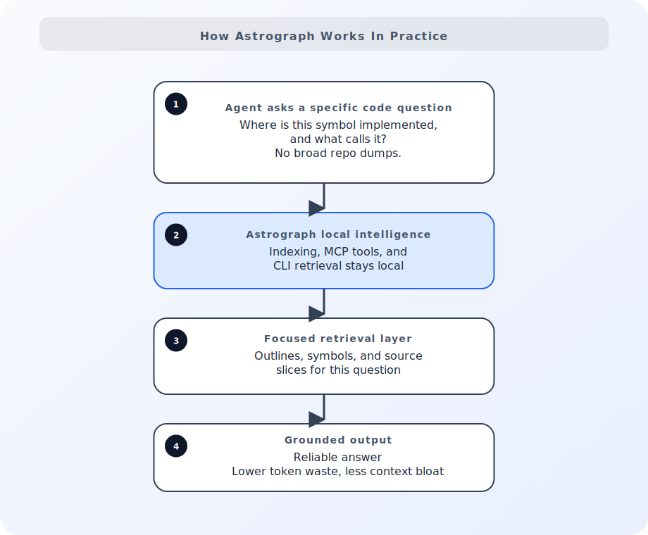

<p align="center">
  <a href="https://github.com/mortenbroesby/astrograph">
    
  </a>
</p>

<p align="center">
  Reliable, source-grounded code answers for AI agents.
</p>

<p align="center">
  Local, deterministic code intelligence with less context bloat and lower token waste.
</p>

<p align="center">
  <a href="https://www.npmjs.com/package/astrograph"></a>
  <a href="https://github.com/mortenbroesby/astrograph/actions/workflows/ci.yml"></a>
  <a href="./LICENSE"></a>
  
</p>

<p align="center">
  <a href="#why-astrograph">Why Astrograph</a>
  <span> | </span>
  <a href="#key-features">Key features</a>
  <span> | </span>
  <a href="#use-cases">Use cases</a>
  <span> | </span>
  <a href="#quick-start">Quick start</a>
  <span> | </span>
  <a href="#global-installation">Global installation</a>
  <span> | </span>
  <a href="./docs/README.md">Docs</a>
  <span> | </span>
  <a href="#documentation">Documentation</a>
</p>

---



<a id="why-astrograph"></a>
## 🔭 Why Astrograph

Astrograph gives coding agents a local-first, structured way to navigate codebases
without dumping full-repo context. It returns symbol-accurate insights faster,
with source-linked confidence, and lower token spend across long sessions.

<a id="key-features"></a>
## ✨ Key Features

- 🧠 **Persistent Context State** - stable indexing and diagnostics across sessions
- 📊 **Progressive Retrieval** - less noise, fewer tokens, faster answers
- 🔍 **Skill-Based Search** - find symbols, outlines, and dependencies by intent
- 🛠️ **MCP + CLI Surfaces** - one retrieval engine for agents and shell
- 🖥️ **Tooling Integration** - wire into Codex or Copilot once
- 🧹 **Health & Refresh** - detect drift and fix stale indexes quickly
- 🧪 **Token-Aware by Design** - fetch just enough context, not full files

## 🧭 What It Is

Astrograph is a local MCP server and CLI for code intelligence. It indexes your
repository locally and exposes focused tools for file outlines, symbol lookup,
source retrieval, code-aware search, diagnostics, and refresh workflows.

Use it when you want an agent to ask targeted questions about real code
structure instead of reading half the repository and hoping it found the right
thing.

## 🚫 What It Is Not

Astrograph is not:

- a memory layer for prior sessions
- a generic chat shell around an LLM
- a brute-force repo-to-context pipeline
- a remote indexing service you have to ship your repo to

It is the code-intelligence layer: local-first, source-grounded, and
deterministic enough to give agents a better starting point than grep plus huge
context windows.

<a id="use-cases"></a>
## ✨ Use Cases

Reach for Astrograph when you want an agent to:

- jump from a symbol name to its real implementation
- trace a code path across files before making an edit
- answer repository questions without loading whole files into context
- gather precise source context before planning or patching code
- stay efficient in larger repos where broad context gets noisy and expensive

## ⚙️ How It Works

Astrograph indexes your codebase locally and exposes structured tools over MCP
and CLI surfaces. Instead of treating the repository like raw text, agents can
ask for outlines, symbols, source, search results, diagnostics, and targeted
context bundles.

That is where the token savings come from: better questions, smaller retrievals,
and fewer blind scans.

## 🪓 Why Not Just Grep and File Reads?

Because the default agent fallback is usually too blunt.

Broad search, repeated full-file reads, and oversized context windows are noisy,
expensive, and easy to derail. Astrograph gives the agent structured access to
code so it can retrieve less and understand more.

<a id="quick-start"></a>
## 🚀 Quick Start

### 1) Install

Use dependency-based setup if you want `astrograph` available in repository
scripts:

```bash
npm install -D astrograph
```

### 2) Configure MCP

Run the installer from the repository you want to index:

```bash
npx astrograph init
```

This writes MCP configuration for your target editor or agent client and
preserves unrelated local config. `npx` downloads and runs Astrograph when it
is not already installed locally.

If you want non-interactive setup:

```bash
npx astrograph init --yes --repo /absolute/path/to/repo
```

Choose a specific target when needed:

```bash
npx astrograph init --ide codex
npx astrograph init --ide copilot
npx astrograph init --ide copilot-cli
npx astrograph init --ide all
```

For a fresh repository, create the initial index before first use:

```bash
npx astrograph cli index-folder --repo /absolute/path/to/repo
```

### 3) Start your agent session

Once the MCP config is written, start your editor or CLI agent session and use
Astrograph's retrieval tools against the local repository.

<a id="global-installation"></a>
## 🌍 Global Installation and Use (Codex and Copilot CLI)

Use global setup when you want one user-level MCP registration that works
across repositories. Codex and Copilot CLI are first-party global targets.
Astrograph keeps an isolated cache for each canonical repository root; it never
combines source or mutable index data from separate repositories.

### 1) Install the command

Global setup requires Node.js `>=22.12.0`. Install Astrograph, then open a new
shell if your npm global bin directory was not already on `PATH`:

```bash
npm install --global astrograph
astrograph --help
```

### 2) Register your global server

For Codex:

```bash
astrograph install --global --ide codex
```

For Copilot CLI:

```bash
astrograph install --global --ide copilot-cli
```

The installer adds only Astrograph’s managed server entry to the client’s
user-level configuration: `~/.codex/config.toml` for Codex, or
`~/.copilot/mcp-config.json` for Copilot CLI (`$COPILOT_HOME/mcp-config.json`
when that variable is set). It also writes the global-storage preference to
your user-level Astrograph configuration. It does not modify any repository.
Restart the selected harness after this command so it loads the MCP server.

To preview the changes without writing files:

```bash
astrograph install --global --ide copilot-cli --dry-run
```

### 3) Use any repository — no repo setup

Open Codex or Copilot CLI in any repository. The global registration finds the current
repository and uses its own isolated directory beneath the global cache root.
You do **not** run `astrograph init`, create `astrograph.config.*`, choose a
cache directory, or add `.codex` or `.mcp.json` files in that repository.

Create the first index from Codex with `index_folder`, or run this command from
any shell:

```bash
astrograph cli index-folder --repo /absolute/path/to/repo
astrograph cache status --repo /absolute/path/to/repo
```

Thereafter, use Astrograph normally from Codex or Copilot CLI. Astrograph
automatically uses the repository you opened and its isolated global cache.

### 4) Repository-local setup is an explicit alternative

Global setup makes global storage the user default. Use repository-local
`init` only when you intentionally want workspace-owned MCP configuration or
storage. A repository can opt out with `storageLocation: "repo-local"` in
`astrograph.config.ts` or `astrograph.config.json`; an explicit CLI flag wins
for one command:

```bash
astrograph cli index-folder --repo /absolute/path/to/repo --storage-location global
astrograph cli diagnostics --repo /absolute/path/to/repo --storage-location repo-local
```

## 🧩 IDE Setup

Astrograph currently supports MCP setup for Codex, GitHub Copilot, and GitHub
Copilot CLI.

Codex writes `.codex/config.toml`:

```bash
npx astrograph init --yes --ide codex --repo /absolute/path/to/repo
```

GitHub Copilot writes `.vscode/mcp.json`:

```bash
npx astrograph init --yes --ide copilot --repo /absolute/path/to/repo
```

GitHub Copilot CLI writes `.mcp.json`:

```bash
npx astrograph init --yes --ide copilot-cli --repo /absolute/path/to/repo
```

To configure multiple clients in one pass:

```bash
npx astrograph init --yes --ide all --repo /absolute/path/to/repo
npx astrograph init --yes --ide codex,copilot --repo /absolute/path/to/repo
```

## Global Cache

Global setup is opt-in. It stores a separate SQLite cache for each canonical
repository root and keeps all source paths, index contents, and events on the
current OS user’s machine. Repository `astrograph.config.ts` or
`astrograph.config.json` can override it with `storageLocation: "repo-local"`.
For one CLI invocation, `--storage-location repo-local|global` takes precedence
over both repository and user defaults.

Use these JSON-first commands to inspect or recover a selected repository:

```bash
astrograph cache status --repo /absolute/path/to/repo
astrograph cache migrate --repo /absolute/path/to/repo
astrograph cache migrate --repo /absolute/path/to/repo --yes
astrograph cache remove --repo /absolute/path/to/repo --yes
astrograph cache prune --all --max-bytes 1073741824
astrograph cache prune --all --max-bytes 1073741824 --yes
```

`cache status` reports the canonical repository, selected storage, and the
checkout identity that last populated that cache. Its `checkout` field is
`null` before an index exists.

Migration first validates and copies the local cache into global storage; it
never removes `.astrograph`. Cache migration and removal are CLI-only and
default to dry-run. Pruning is explicitly all-cache scoped, removes oldest
inactive repository caches first, and also defaults to dry-run. Global cache roots are `~/.cache/astrograph` on Linux
(or `$XDG_CACHE_HOME/astrograph`), `~/Library/Caches/astrograph` on macOS, and
`%LOCALAPPDATA%\\astrograph\\cache` on Windows.

<a id="documentation"></a>
## 📚 Documentation

The README is the short version. Use the docs for operational detail:

- [Docs compendium](./docs/README.md)
- [Concepts](./docs/getting-started/concepts.md)
- [First steps](./docs/getting-started/first-steps.md)
- [CLI reference](./docs/reference/cli.md)
- [Performance guide](./docs/guides/performance.md)
- [Release reference](./docs/reference/release.md)
- [Ralph runner](./docs/guides/ralph-runner.md)

## 🧪 Project Status

Astrograph is still early. Expect rough edges, but the core value proposition is
already usable today.

## 📦 Install Details

- Node target: `>=22.12.0` (Node 22 LTS or newer; Node 24 is supported)
- Entry command: `astrograph`
- Supported terminals on Windows: PowerShell, `cmd.exe`, and Git Bash.
- Git is optional for ordinary indexing and retrieval. When Git is unavailable
  or the folder is not a Git checkout, Astrograph uses a safe filesystem
  fallback; Git metadata only enriches checkout identity and refresh behavior.

## ⚖️ License

MIT. See [LICENSE](./LICENSE).

## 🙏 Acknowledgements

- `pnpm`, `Turborepo`, `Vite`, `React`, and `Vitest` for the core workspace foundation

---

## 👤 Author

**Morten Broesby-Olsen** (mortenbroesby)

- GitHub: [@mortenbroesby](https://github.com/mortenbroesby)
- LinkedIn: [mortenbroesby](https://www.linkedin.com/in/morten-broesby-olsen/)

---

<p align="center">
  Made with ☕ and ⚡️ by Morten Broesby-Olsen
</p>
