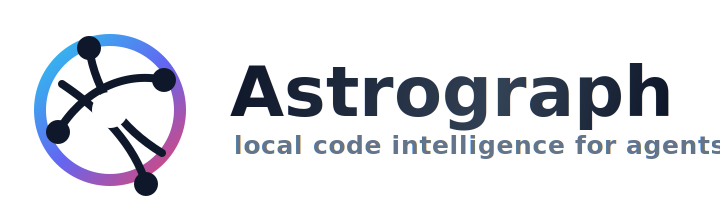

<p align="center">
  <a href="https://github.com/mortenbroesby/astrograph">
    
  </a>
</p>

<p align="center">
  Local, deterministic code intelligence for AI agents.
</p>

<p align="center">
  <a href="https://www.npmjs.com/package/@mortenbroesby/astrograph"></a>
  <a href="https://github.com/mortenbroesby/astrograph/actions/workflows/ci.yml"></a>
  <a href="./LICENSE"></a>
  
</p>

<p align="center">
  <a href="#quick-start">Quick start</a>
  <span> | </span>
  <a href="./docs/CLI.md">CLI</a>
  <span> | </span>
  <a href="#ide-setup">IDE setup</a>
  <span> | </span>
  <a href="#documentation">More</a>
</p>

---

Astrograph is a local MCP server for AI agents.  
You add it to a repo, run one command to generate MCP config, and let your IDE
consume `query_code`, `find_files`, and related retrieval tools.

## Why this exists

So your AI tools can inspect the right file, the right symbol, and the right
context — fast and with clear freshness signals.

## Quick start (recommended)

### 1) Install

Use dependency-based setup if you want `astrograph` in package scripts:

```bash
npm install -D @mortenbroesby/astrograph
```

Or install globally:

```bash
npm install -g @mortenbroesby/astrograph
```

### 2) Configure MCP (default: Copilot)

```bash
astrograph init
```

Want control over where setup writes MCP config? Pick the IDE target:

```bash
astrograph init --ide codex
astrograph init --ide copilot
astrograph init --ide copilot-cli
astrograph init --ide all
```

If you need non-interactive install:

```bash
npx @mortenbroesby/astrograph init --yes --repo /absolute/path/to/repo
```

If you are not using a global install:

```bash
npx @mortenbroesby/astrograph init
```

### 3) Start your IDE session and use your agent tools.

Your tooling reads the generated MCP config and you are done.

### IDE Setup

Astrograph can configure MCP settings for Codex, GitHub Copilot, and GitHub
Copilot CLI. Non-interactive default is `--ide copilot`.
If a newer Astrograph release is published, `init` prints a short update hint:
`npm install @mortenbroesby/astrograph@latest`.

```bash
astrograph init
```

Codex (`.codex/config.toml`):

```bash
astrograph init --yes --ide codex --repo /absolute/path/to/repo
```

GitHub Copilot (`.vscode/mcp.json`):

```bash
astrograph init --yes --ide copilot --repo /absolute/path/to/repo
```

GitHub Copilot CLI (`.mcp.json`):

```bash
astrograph init --yes --ide copilot-cli --repo /absolute/path/to/repo
```

The installer resolves the repo root and preserves unrelated IDE config.

To configure multiple agent clients in one pass:

```bash
astrograph init --yes --ide all --repo /absolute/path/to/repo
astrograph init --yes --ide codex,copilot --repo /absolute/path/to/repo
```

## Documentation

- Use this for command details: [CLI reference](./docs/CLI.md)
- [Performance workflow](./docs/performance.md)
- [Contributing](./CONTRIBUTING.md)
- [Release and publishing](./docs/release.md)

## Install details

- Node target: `>=24`
- Entry commands:
  - `astrograph` (preferred)
  - `ai-context-engine` (compatibility alias)

## License

MIT. See [LICENSE](./LICENSE).

## Acknowledgements

- `pnpm`, `Turborepo`, `Vite`, `React`, and `Vitest` for the core workspace foundation

---

## Author

**Morten Broesby-Olsen** (mortenbroesby)

- GitHub: [@mortenbroesby](https://github.com/mortenbroesby)
- LinkedIn: [mortenbroesby](https://www.linkedin.com/in/morten-broesby-olsen/)

---

<p align="center">
  Made with ☕ and ⚡️ by Morten Broesby-Olsen
</p>
