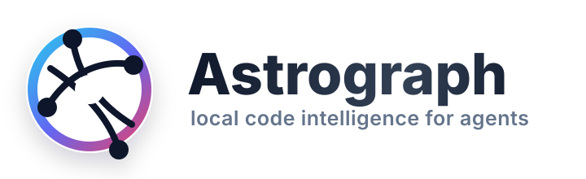

<p align="center">
  <a href="https://github.com/mortenbroesby/astrograph">
    
  </a>
</p>

<p align="center">
  Local, source-grounded code intelligence for AI agents.
</p>

<p align="center">
  <a href="https://www.npmjs.com/package/astrograph"></a>
  <a href="https://github.com/mortenbroesby/astrograph/actions/workflows/ci.yml"></a>
  <a href="./LICENSE"></a>
  
</p>

<p align="center">
  <a href="#start-here">Start here</a>
  <span> | </span>
  <a href="#key-features">What you get</a>
  <span> | </span>
  <a href="#documentation">Documentation</a>
</p>

---

## 🗺️ A Map for Your Codebase, Not Another Agent

### ✨ What is Astrograph?

Astrograph gives AI coding agents a local, structured map of your codebase.
Instead of reading whole repositories into context, they can ask for outlines,
symbols, source, and targeted task context.

### 🚫 What it is not

Astrograph is not another coding agent, a hosted code service, or a replacement
for your editor, Git, or tests. Your code stays local. It is also not a generic
vector database or RAG service: it builds a structured code index for precise
retrieval. Read [the concepts guide](./docs/getting-started/concepts.md#what-astrograph-is-not)
when you want the deeper model.

<a id="start-here"></a>
## 🚀 Start Here

In the repository you want to explore:

```bash
npx --yes astrograph
```

Or install Astrograph globally once when you want the `astrograph` command
available in your shell:

```bash
npm install --global astrograph@latest
astrograph install
```

Both paths open the same guided setup. Choose your AI client and setup scope,
then restart the client.

- **This device** connects your client once and keeps a private index for each
  repository. It does not change repositories unless you opt into indexing one.
- **This repository** creates project-owned configuration that collaborators
  can review.

Global installation gives you a permanent `astrograph` command; **This device**
is the device-wide setup scope. You can use either `npx` or the global command
to choose it. The installer explains every write before it makes it. For
automation and recovery commands, use the [CLI reference](./docs/reference/cli.md).

New to Astrograph? Follow the [five-minute setup](./docs/getting-started/first-steps.md).

<a id="key-features"></a>
## ✨ What You Get

- 🧠 **Persistent local context** — an index per repository, stored on your machine
- 🔍 **Progressive retrieval** — outlines, symbols, source, then bounded context when needed
- 🛠️ **MCP + CLI surfaces** — the same engine for Codex, Copilot, and the shell
- 🧹 **Health and refresh tools** — inspect stale indexes instead of guessing
- 🧪 **Measured output efficiency** — source-grounded results with explicit evidence

## 🧪 Evidence, Not Promises

Astrograph ships reproducible benchmarks. The current compact-response baseline
uses 55.6%–66.7% fewer `cl100k_base` tokens on its fixture; it is a
response-size measurement, not a productivity claim. See [benchmark
evidence](./docs/guides/benchmarks.md) for the method and limits.

<a id="documentation"></a>
## 📚 Documentation

Start with the [five-minute setup](./docs/getting-started/first-steps.md), then
choose the document that matches your task:

- [Docs compendium](./docs/README.md)
- [Concepts](./docs/getting-started/concepts.md)
- [First steps](./docs/getting-started/first-steps.md)
- [Retrieval workflows](./docs/guides/retrieval-workflows.md)
- [Troubleshooting](./docs/guides/troubleshooting.md)
- [Performance](./docs/guides/performance.md) and [benchmark evidence](./docs/guides/benchmarks.md)
- [CLI reference](./docs/reference/cli.md) and [config reference](./docs/reference/config.md)
- [Language support](./docs/reference/language-support.md)
- [Release reference](./docs/reference/release.md)

## Requirements

Astrograph supports Node 20.19+, 22, and 24. Git is optional: without it,
Astrograph uses a safe filesystem fallback. Its parser uses packaged WebAssembly
grammars, so installing Astrograph does not compile Tree-sitter or require a
C++ toolchain for parsing.

## ⚖️ License

MIT. See [LICENSE](./LICENSE).

## 🙏 Acknowledgements

- `pnpm`, `Turborepo`, `Vite`, `React`, and `Vitest` for the core workspace foundation
- Tree-sitter and its grammar maintainers for local, structured parsing
- the Model Context Protocol ecosystem for a common agent integration surface
- the open-source maintainers whose work makes local-first developer tooling possible

---

## 👤 Author

**Morten Broesby-Olsen** (mortenbroesby)

- GitHub: [@mortenbroesby](https://github.com/mortenbroesby)
- LinkedIn: [mortenbroesby](https://www.linkedin.com/in/morten-broesby-olsen/)

---

<p align="center">
  Made with ☕ and ⚡️ by Morten Broesby-Olsen
</p>
