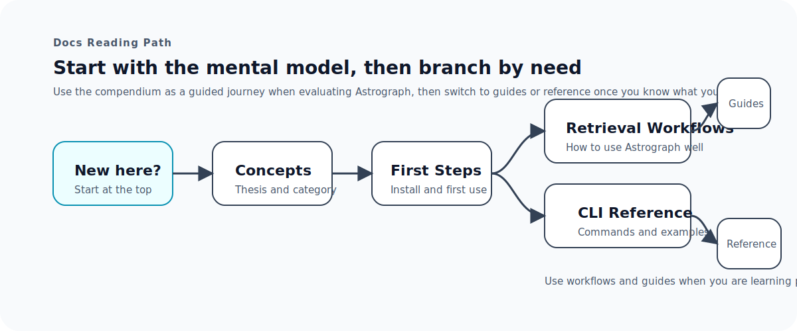

# Astrograph Docs

Astrograph's README explains the thesis. This compendium explains how to use,
operate, and reason about the tool without turning the root page into a wall of
detail.

## Start Here

If you are new to Astrograph, read these in order:

1. [Concepts](./getting-started/concepts.md)
2. [First Steps](./getting-started/first-steps.md)
3. [Retrieval Workflows](./guides/retrieval-workflows.md)
4. [CLI Reference](./reference/cli.md)

## Getting Started

- [Concepts](./getting-started/concepts.md)
  The short mental model: what Astrograph is, what it is not, and why it saves
  tokens.
- [First Steps](./getting-started/first-steps.md)
  Install Astrograph, wire up MCP, run a few useful commands, and know what to
  do next.

## Guides

- [Retrieval Workflows](./guides/retrieval-workflows.md)
  The default Astrograph retrieval shape: outline first, then symbol, then
  source, then context escalation only when needed.
- [Performance Guide](./guides/performance.md)
  When to care about performance, what to measure, and which knobs actually
  matter.
- [Troubleshooting](./guides/troubleshooting.md)
  What to do when the repo is not indexed, stale, unhealthy, or missing watch
  refresh.
- [Ralph Runner](./guides/ralph-runner.md)
  The opt-in autonomous runner for planning-oriented story loops in this repo.

## Reference

- [CLI Reference](./reference/cli.md)
  Command groups, common examples, config shape, and development commands.
- [Config Reference](./reference/config.md)
  The repo-level `astrograph.config.ts` surface and the knobs that matter.
- [Release Reference](./reference/release.md)
  How Astrograph versions, plans, and publishes npm releases.

## Reviews

- [Staff Engineer Review — July 2026](./reviews/staff-engineering-review-2026-07.md)
  Evidence-based architectural and engineering assessment with a proportionate
  Now/Next/Later roadmap.
- [Windows Compatibility Audit — July 2026](./reviews/windows-compatibility-audit-2026-07.md)
  Evidence map and story handoff for Windows Node terminals and Git Bash.

## Reading Strategy

- Start with the getting-started pages if you are evaluating Astrograph.
- Jump straight to reference if you already know what you need.
- Use guides when you are optimizing, troubleshooting, or adopting optional
  workflows.
