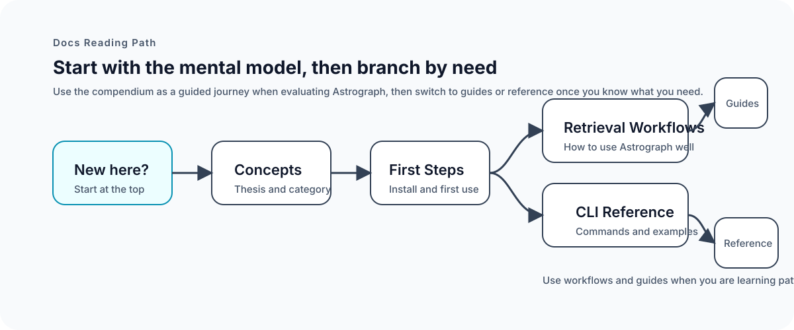

# Astrograph Docs

The README gets you started. This page helps you find the detail you need.

## Start Here

New to Astrograph? Start here:

1. [First Steps](./getting-started/first-steps.md)
2. [Retrieval Workflows](./guides/retrieval-workflows.md)

## Getting Started

- [Concepts](./getting-started/concepts.md)
  The mental model: what Astrograph is, when it helps, and why structured
  retrieval beats broad file reading.
- [First Steps](./getting-started/first-steps.md)
  Install Astrograph, connect an AI client, and make the first useful query.

## Guides

- [Retrieval Workflows](./guides/retrieval-workflows.md)
  The default Astrograph retrieval shape: outline first, then symbol, then
  source, then context escalation only when needed.
- [Performance Guide](./guides/performance.md)
  When to care about performance, what to measure, and which knobs actually
  matter.
- [Benchmark Evidence](./guides/benchmarks.md)
  Reproducible workflow and MCP-output measurements, with their limits.
- [Local Container Verification](./guides/local-container-verification.md)
  Run the full test suite locally in an isolated Linux container without using
  GitHub Actions minutes.
- [Troubleshooting](./guides/troubleshooting.md)
  What to do when the repo is not indexed, stale, unhealthy, or missing watch
  refresh.

## Reference

- [CLI Reference](./reference/cli.md)
  Command groups, common examples, config shape, and development commands.
- [Config Reference](./reference/config.md)
  The repo-level `astrograph.config.ts` surface and the knobs that matter.
- [Language Support](./reference/language-support.md)
  Exact parser-backed languages, tiers, extensions, and evidence-based exclusions.
- [Release Reference](./reference/release.md)
  Contributor-only release workflow.

## For Contributors

- [Contributing](../CONTRIBUTING.md)
- [Local container verification](./guides/local-container-verification.md)
- [Release reference](./reference/release.md)
- [Ralph runner](./guides/ralph-runner.md)
- [Historical reviews and audits](./reviews/)

## Reading Strategy

- Start with First Steps when evaluating Astrograph.
- Go straight to Reference when you know the command or setting you need.
- Use Guides for retrieval habits, troubleshooting, and performance work.
