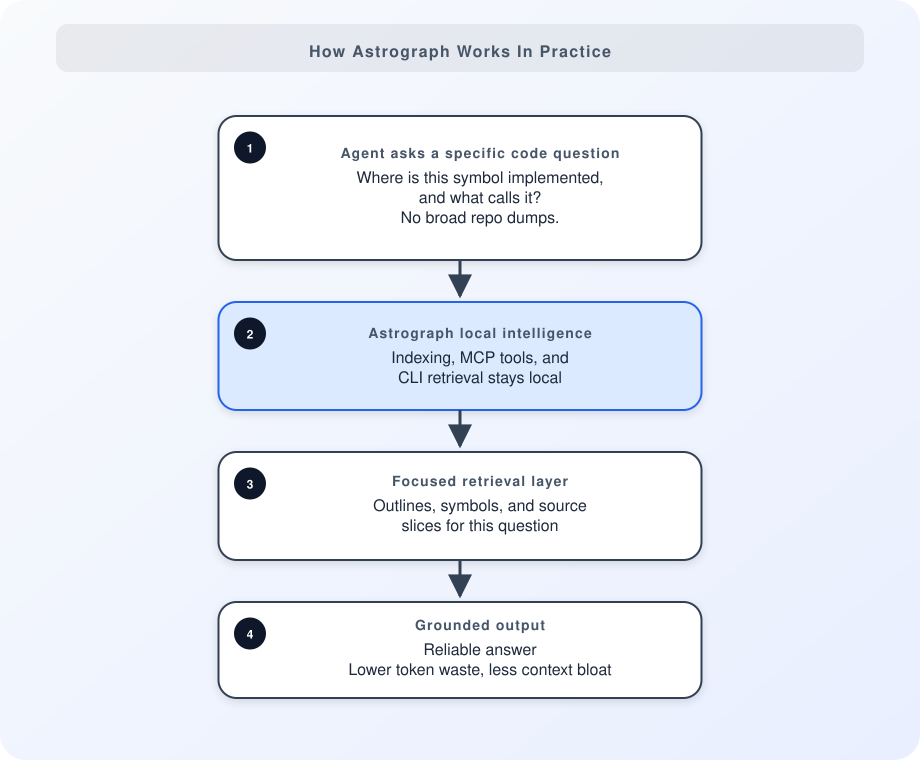

# Astrograph Concepts

Astrograph is local code intelligence for AI agents. It helps an agent ask
smaller, source-grounded questions about the repository on disk instead of
defaulting to broad search and repeated file dumps.

## The Retrieval Model

Astrograph indexes code locally and exposes outlines, symbols, source slices,
and bounded task context through MCP and the CLI. The usual path is:

1. inspect structure
2. find the relevant symbol or file
3. retrieve the source you need
4. ask for broader context only when necessary

This keeps answers closer to source and avoids accumulating irrelevant context
in long sessions.

## What It Is—and Is Not

Astrograph is a local, deterministic MCP and CLI surface for code exploration.
It complements your editor, Git, tests, and coding agent.

It is not a hosted indexing service, a generic vector database, a session-memory
system, or another agent shell. It indexes the working tree you are actually
using; no remote sync is required.

## When It Helps

Use Astrograph to find an implementation, trace a code path, inspect an
unfamiliar repository, or gather focused context for planning, debugging, and
refactoring.

For the supported languages and retrieval tiers, see
[Language Support](../reference/language-support.md). For exact commands, see
the [CLI Reference](../reference/cli.md).
